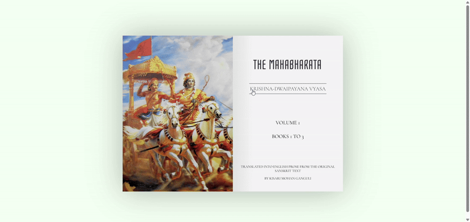
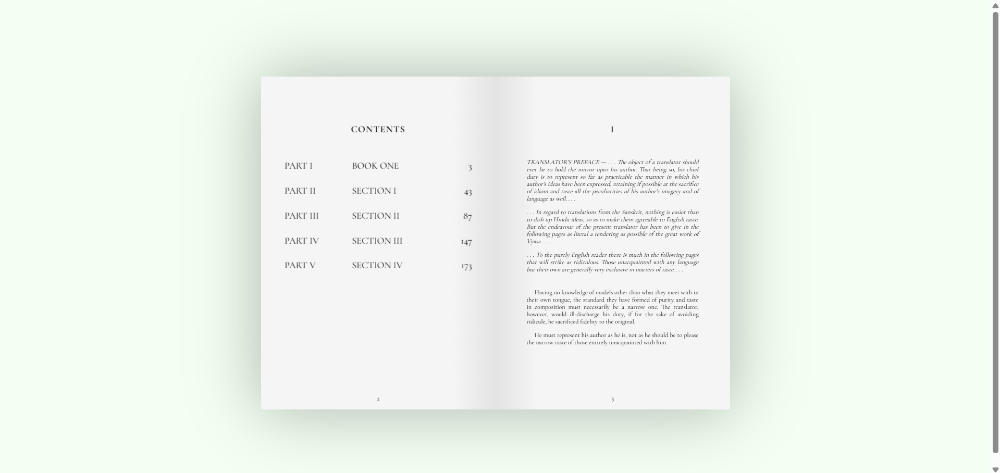

# ✨ ChapterSwipe – Smooth Page-Turning Effects with Pure CSS 📖
## 🌐 Socials:
  

**ChapterSwipe** is a modern, interactive UI that mimics the feeling of flipping through book pages, powered entirely by CSS. This project demonstrates smooth, realistic page-turning animations, perfect for creating digital books, magazines, or any content that benefits from a dynamic, book-inspired layout.

---

## 🚀 Features

- 📚 **Realistic Page-Turning Animation** – Smooth and elegant CSS-powered page transitions.
- 🎯 **Interactive UI** – Engaging user experience with intuitive page navigation.
- 🎨 **No JavaScript Required** – The page-flipping effect is achieved with pure CSS.
- 🧑‍💻 **Easy to Customize** – Perfect for digital books, portfolios, or creative content.

---

## 🛠️ Tech Stack

- **HTML5**
- **CSS3 (Flexbox, Transitions, Transformations)**
- **SASS (optional for easier management of styles)**

---
---

 
Desktop Desgin 

 
Desktop Desgin ui-ux Layout 

 
Desktop Desgin 

 
Cover 
